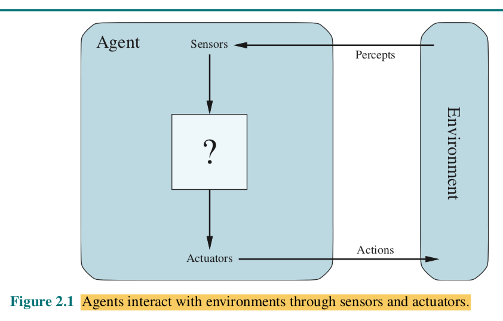

Práctica MIA - Quién es quién 
=============================

 * [Contenidos](#contenidos)
 * [El problema](#el-problema)
 * [Implementación](#implementación)
 * [Reglas del juego](#reglas-del-juego)
 * [Optimización vs Búsquedas](#1-optimización-vs-búsquedas)
 * [Entorno del agente](#2-entorno-del-agente)
 * [Algoritmo](#3-algoritmo)
 * [Estrutura del agente](#4-estrutura-del-agente)
 * [Programación lógica](#5-programación-lógica)
 * [Base de datos Prolog](#6-base-de-datos-prolog)
 * [Entrega](#entrega)
 * [Bibliografía](#bibliografía)

## Contenidos

Esta práctica involucra los contenidos del módulo de Modelos de Inteligencia Artificial tratados en las sesiones del curso:

 - [Algoritmos de búsqueda.](https://drive.google.com/drive/u/0/folders/1GSPdhrE0nXqVFnVk1hvhUUZ6R7cyjSqQ)
 - [Algoritmos de optimización.](https://drive.google.com/drive/u/0/folders/1z8J-1gUvP6i8WHhWh2FfobLOTxK1N_hH)
 - [Representación del conocimiento.](https://drive.google.com/drive/u/0/folders/1i3QhT8sDhuMnMTHek8lxCDWgWiMQVUGc)
 - [Lógica de primer orden.](https://drive.google.com/drive/u/0/folders/1DlTxaOVfo8HhoA-qQjrhvXuntBol3luL)
 - [Prolog.](https://github.com/dfleta/prolog-for-IA)

## El problema

Programa en Python y/o Prolog la lógica para resolver una partida del juego quién es quién. Puedes construir de manera completa el programa en Prolog. Si prefieres utilizar Python, al menos debes satisfacer el requisito de **construir una base de datos de hechos en Prolog** con los personajes y sus rasgos. 

## Implementación

Si optas por esta segunda opción (Python + Prolog), lee los [casos test](./test/test_quienesquien.py) que proporciono para observar cómo debes utlizar el paquete Python [pyswip](https://github.com/yuce/pyswip) para lanzar consultas a la base de datos Prolog y recibir la respuesta en una estructura Python. En la documentación de [pyswip](https://github.com/yuce/pyswip) encontrarás más ejemplos de uso.

Si optas por la primera de las opciones (empleando únicamente Prolog), puedes utilizar los [casos test](./test/test_quienesquien.py) que proporciono como guía para el desarrollo de la aplicación practicando programación dirigida por casos test (TDD). 

No he especificado ni publicado en el repo la función que codifica el algoritmo de optimización puesto que es decisión de cada uno/a proponer el algoritmo de optimización que considere más adecuado al problema.

**No se permite el uso de ninguna librería externa con algoritmos de búsqueda u optimización**.

El código entregado ha de contener una implementación original (i.e., no reutilizada) del algoritmo seleccionado de entre los de la bibliografía proporcionada.

Cualquier sospecha de implementación derivada de cualquier agente de IA de uso comercial será penalizada.

## Reglas del juego

La lógica del juego es la esperada, salvo porque en las instrucciones del juego vintage se indica que la primera pregunta no puede ser "es hombre" o "es mujer" (consecuencia de la cultura de los 80).

Extrae de la imagen proporcionada (versión vintage del juego) las características de los personajes, de la manera más realista posible, sin inventar ninguno de los rasgos. Respeta los nombres de los personajes.

Si alguien necesita jugarlo de manera táctil ;) que me pida el juego.

## Contesta a las siguientes preguntas antes de desarrollar el programa agente.

### 1. Optimización vs Búsquedas

Justifica por qué este juego puede considerarse un problema de optimización. Consulta la bibliografía recomendada.

### 2. Entorno del agente

Describe el entorno del agente en los términos tratados en la primera unidad didáctica y proyecto de este módulo.

Resume las características del entorno en una tabla con el formato:

Entorno de tareas | Completamente / parcialmente Observable| Agentes | Determinista / Estocástico | Episódico / Secuencial | Estático / Dinámico | Discreto / Continuo
:---: | :---: | :---: | :---: | :---: | :---: | :---: |
 RPS | - | - | - | - | - |  - |

### 3. Algoritmo.

Justifica la adecuacióm del algoritmo de optimización que has seleccionado.

### 4. Estrutura del agente

Nuestro propósito és diseñar el **programa agente** que implementa la **función agente** o la **función que mapea** las percepciones a las acciones. 

A partir del modelo general de agente inteligente de la figura:

**dibuja un modelo adecuado** al entorno de tareas y a un de los cuatro **tipos de programas agente**:

- Agentes reactivos simples.
- Agentes reactivos basados en modelos.
- Agentes basados en objetivos.
- Agentes basados en utilidad.

Cada clase de agente combina componentes particulares de un modo particular para generar las acciones. 

### 5. Programación lógica

Justifica por qué el "quién es quién" puede considerarse un problema adecuado para ser resuelto empleando el paradigma de programación lógica. Chequea el capítulo 1 del libro _Beginning Java 8 Fundamentals_ disponible en la bibliografía, explicado en las sesiones del curso.

### 6. Base de datos Prolog

Justifica la representación que has implementado mediante estructuras Prolog.

Repasa los contenidos de mis apuntes Prolog disponibles en [Prolog for IA](https://github.com/dfleta/prolog-for-IA).

## Entrega

En un proyecto en tu github /gitlab con tu código y la documentación, esta última recogida en el `README` del proyecto y escrita en formato Markdown.

Para la instalación del proyecto, puedes utilizar el tutorial sobre distribución de código Python en el proyecto explicado en las sesiones del módulo:

[dependencias y pip-compile](https://github.com/dfleta/ollivanders?tab=readme-ov-file#dependencias)

## Bibliografía

Bratko, I. _Prolog, programming for Artificial Intelligence_. Addison-Wesley/Pearson, 2012.

Hurbans, Rishal. _grokking Artificial Intelligence Algorithms_. Manning Publications Co, 2020. 

Lutz, Mark. _Learning Python_. Sebastopol, Ca, O’reilly, 2018.

Martin, Robert C. _Clean Code a Handbook of Agile Software Craftmanship_. Upper Saddle River [Etc.] Prentice Hall, 2010.

Martin, Robert C. _Clean Architecture: A Craftsman’s Guide to Software Structure and Design_. Prentice Hall, 2018.

S. McConnel. _Code Complete: A Practical Handbook of Software Construction_, 2dn Edition. Microsoft Press, 2004.

Sharan, Kishori. _Beginning Java 8 Fundamentals: Language Syntax, Arrays, Data Types, Objects, and Regular Expressions_. Apress, 2014.

Russell, Peter. _ARTIFICIAL INTELLIGENCE : A Modern Approach_, Global Edition. S.L., Pearson Education Limited, 2021.

“Título de la fuente”, Título de recurso contenedor en cursiva, Fecha de publicación. Localización.

@dfleta. "Prolog for IA". _github_, 28 de febrero de 2024. https://github.com/dfleta/prolog-for-IA

@dfleta. "API REST con Flask y Mongo Atlas". _github_, 29 de marzo de 2022. https://github.com/dfleta/ollivanders
