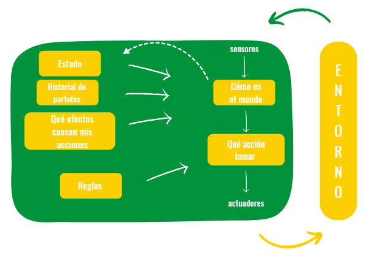

Quién es quién 
=============================

### 1. Optimización vs Búsquedas

El juego de *Quién es quién* encaja perfectamente en la categoría de los problemas de optimización, ya que el objetivo consiste en ser el primero en determinar qué personaje seleccionó el oponente. Si bien existen distintas estrategias para lograrlo, el reto consiste en encontrar el camino más eficiente para cumplir la función objetivo, que en este caso es acertar la carta del rival, en los menores intentos posibles.

### 2. Entorno del agente

Entorno de tareas | Observable| Agentes | Determinista / Estocástico | Episódico / Secuencial | Estático / Dinámico | Discreto / Continuo 
:---: | :---: | :---: | :---: | :---: | :---: | :---: |
 Quién es quién | Parcialmente | Multiagente | Determinista | Secuencial | Estático |  Discreto |

Parcialmente observable: No se tiene conocimiento del personaje elegido por el rival. Solo se consigue información a través de las preguntas.

Multiagente: Se considera un entorno multiagente, por que se necesitan dos agentes para jugar, uno selecciona al personaje y responde a las preguntas, el otro es el que tiene que adivinarlo.

Determinista: Las respuestas a las preguntas son determinsitas y no interviene ningún tipo de azar

Secuencial: Las preguntas se hacen una tras otra hasta cumplir la función objetivo, y cada una de ellas depende de la respuesta anterior.

Estático: El entorno es estático por que ni las respuestas ni las características cambian cuando el agente está deliberando.

Discreto: El conjunto de personajes, características y preguntas es finito.

### 3. Algoritmo.

**Algoritmo Voraz**

Se dice que un algoritmo es avaro cuando el camino elegido se considera la mejor opción basándose en un criterio específico sin considerar consecuencias futuras.

Este tipo de algoritmos se puede aplicar al juego quién es quién, porque cumple una propiedad llamada *greedy-choice property*, que consiste en tomar decisiones localmente óptimas que conducen a una solución global.

* Ventajas de utilizar este tipo de algoritmos:

  - Fáciles de implementar y comprender, ya que siguen un enfoque sencillo.
  - Suelen ser eficientes.
        
* Limitaciones:

 - Pierden mejores soluciones al tomar decisiones localmente óptimas.

#### Implementación

En cada una de las rondas del juego, a la hora de elegir qué pregunta hacer, se prioriza la característica que divida de forma equitativa el listado de personajes, con la expectativa de hacerlo de la forma más balanceada posible.

### 4. Estrutura del agente

- Agentes reactivos basados en modelos.

### 5. Programación lógica

El *Quién es quién* es un juego que maneja una gran cantidad de información, en la que cada uno de los personajes tiene una serie de características que lo identifican. Esta serie de atributos es muy sencilla de implementar mediante el paradigma de programación lógica, pudiendo definirlos mediante un conjunto de reglas o restricciones y hechos.

### 6. Base de datos Prolog

Para definir la *knowledge base* del programa se ha utilizado una base de datos en la que, para cada personaje, se define un hecho con la siguiente estructura:

- Una relación --> personaje()
- Nombre del personaje (argumento) --> herman
- Listado de características (argumentos) -->  [hombre, pelirrojo, calva, nariz_grande, ojos_marrones, cejas_gruesas]

        personaje(herman / [hombre, pelirrojo, calva, nariz_grande, ojos_marrones, cejas_gruesas]).

## Bibliografía

@dfleta. "Práctica MIA - Quién es quién" https://github.com/dfleta/quienesquien/tree/main  
What is a Greedy Algorithm? Examples of Greedy Algorithms. https://www.freecodecamp.org/news/greedy-algorithms/  
Greedy Algorithms. https://medium.com/@wepypixel/what-are-greedy-algorithms-examples-of-greedy-algorithms-22a593478e29
